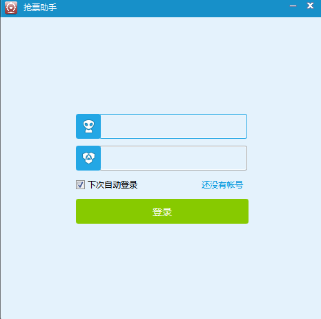

#pyqt环境搭建
#说明
安装环境均在WIN764位下执行
##1 安装软件
- 安装python  
进入[python-3.3.5-Windows x86-64 MSI installer](https://www.python.org/downloads/windows/)下载X64版本，安装。注意，这里为了配合PYQT-5.2，最好选择python3.3。 将C:\Python33添加到环境变量，命令行运行python查看版本，确认对应版本是python3.3，如果环境变量未生效，注销后重新登录PC，应该就没问题了。 
- 安装pyqt  
进入[PyQt5-5.2-gpl-Py3.3-Qt5.2.0-x64](http://sourceforge.net/projects/pyqt/files/PyQt5/PyQt-5.2/)下载X64版本，安装。注意，这里只能选择PYQT-5.2, 试过5.5，有bug。
- 安装opengl  
进入[OPENGL](http://www.microsoft.com/en-US/download/details.aspx?id=35)自动下载安装。

- 安装requests
git路径：git://github.com/kennethreitz/requests.git，先git clone下来，然后运行下面的命令，完成安装。  
    `python setup.py install`  
##2 运行软件
执行  
	`python main.py  `  
或者  
	`main`  
运行效果：  
